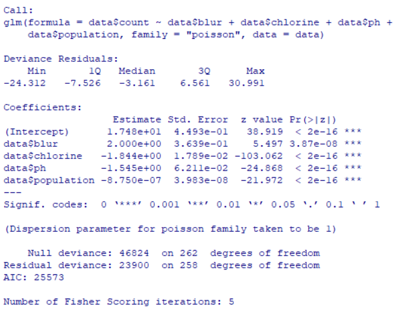

# Arisumin ; 아리수민

본 프로젝트는 서울시 아리수에 대한 시민들의 인식을 고취시키고, 저조한 음용율을 개선하기 위해 시작됐습니다.  

## Details
| 로그인 | 아리수맵 | 음용 측정 |
| :---: | :---: | :---: |
|  |        |  |

## Data Analysis
| 각 개소별 음용횟수 분포 |
| :---: |
|  |

본 분석을 위해서 총 263개의 경기도권 음수대에 대한 정보를 수집했으며, 해당 음수대의 음용횟수 분포는 위 사진과 같습니다.

| 탁도 분포 | 잔류염소 분포 | 산도 분포 | 인구 분포 |
| :---: | :---: | :---: | :---: |
|  |        |  |   |

각 개소별 수질 데이터 (탁도, 잔류염소, 산도)는 다음과 같습니다. 지역 특성을 보정하기 위해 인구 데이터 또한 수집하였습니다.

선형 모델의 경우, 독립변수의 증가 또는 감소 추이에 따른 종속변수의 변화를 예측하는 모델이기에 독립변수의 분포를 확인하는 것이 가장 처음으로 요구됩니다. 각 데이터의 분포는 위의 그래프와 같으며 데이터가 스펙트럼이 넓지 않은 것으로 보아 분석하고자 하는 데이터가 분석을 하기 위해 적합한 데이터는 아닌 것을 확인할 수 있습니다.

| 모델 분석 | 상관계수 분석 |
| :---: | :---: |
|  |        |

GLM과 푸아송 분포를 이용한 모델을 사용하여 데이터를 분석했습니다. 사용하려는 종속변수(음용 횟수)가 정규분포되어 있지 않기 때문에 해당 모델을 채택했으며, 단위공간(음수대 개소)에서의 사건(음용)이 몇 번 발생할 것인가를 표현하기 위해 푸아송 분포를 사용했습니다.

해당 분석을 통해서 독립 변수의 유의성을 확인했으며, 네 개의 독립변수 모두 p-value의 값이 정상 범주 값으로 산출되지 않았습니다. 수집된 데이터들이 양질의 데이터가 아니기 때문에, 높은 에러율에 기반에 결과로 판단할 수 있습니다.  

| z_score | geomap |
| :---: | :---: |
|  |        |

위의 분석에서 유의미한 결과를 얻지 못했으니, 이번에는 인구수 별 음용횟수에 대해 z-score 분석을 하여, 가장 취약한 개소를 찾아 현장분석을 할 수 있는 시작 정보를 제공하려합니다.

z-score은 좌측 그림과 같으며, 0을 기점으로 낮으면 취약개소임을 의미합니다. 우측 그림은 해당 개소들을 Geomap을 통해 시각화한 자료입니다. 표시된 색이 빨강에 가까울 수록 우선적으로 조취가 필요한 개소임을 나타냅니다. 본 Geomap을 통해서 대부분의 경기도 음수대 개소가 시급히 조치를 해야한다는 것을 알 수 있습니다.

## Member
| Programmer | Designer |
| :--------: | :------: |
|    조서완     |   한수민    |
|    채명준     |    류혜린     |

## Contact Us
- 조서완 qowod77@naver.com / [github](https://github.com/whtjdhks3837) / 
- 채명준 cmj9579@naver.com / [github](https://github.com/myungjunChae) /
- 한수민 gkstnals17@naver.com /
- 류혜린 hrrnn@naver.com /